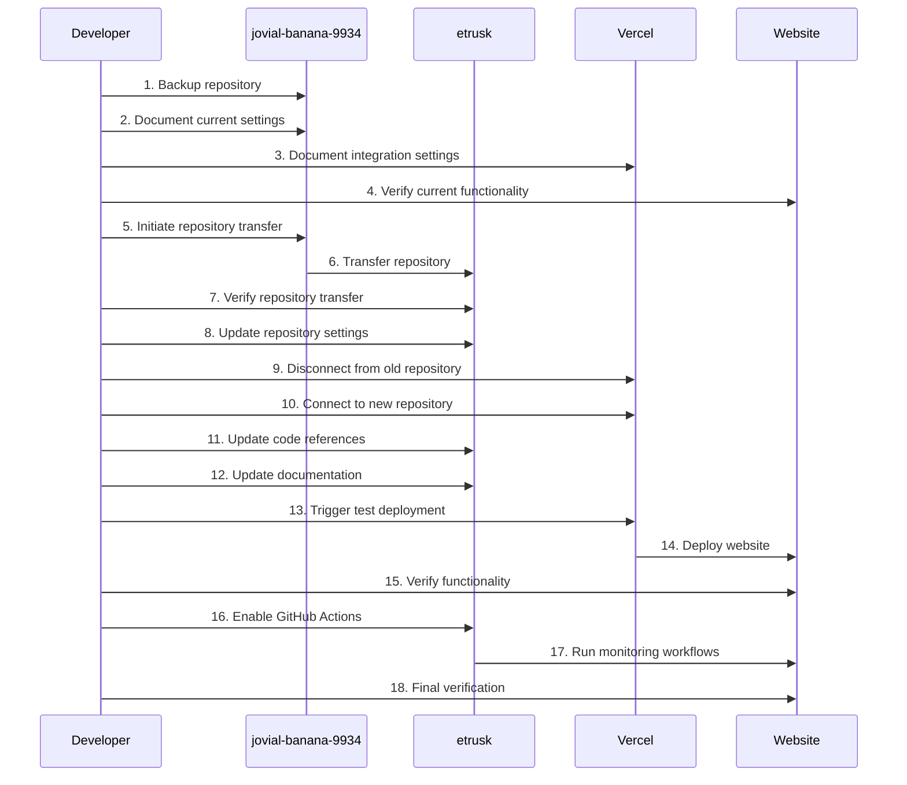

# Design Document: GitHub Account Migration

## Overview

This design document outlines the approach for migrating the MoodOverMuscle website repository from "jovial-banana-9934/moodovermuscle-website" to "etrusk/moodovermuscle". The migration will involve transferring the repository, updating all references to the old GitHub account and repository name throughout the codebase, and ensuring that all integrations (especially with Vercel) continue to function correctly after the migration.

## Architecture

The migration process will follow a systematic approach to ensure a smooth transition with minimal disruption:

1. **Repository Transfer**: Use GitHub's repository transfer feature to move the repository to the new account
2. **Code Updates**: Identify and update all references to the old GitHub account and repository name in the codebase
3. **Integration Reconfiguration**: Update all external integrations, particularly Vercel deployment settings
4. **Verification**: Test all functionality to ensure everything works correctly after the migration

## Components and Interfaces

### 1. GitHub Repository

The core component of this migration is the GitHub repository itself. The repository will be transferred from "jovial-banana-9934/moodovermuscle-website" to "etrusk/moodovermuscle" using GitHub's repository transfer feature.

**Key Considerations:**
- Repository transfer preserves all history, branches, issues, and pull requests
- Repository settings need to be verified after transfer
- GitHub Pages settings may need to be reconfigured
- Branch protection rules need to be verified

### 2. GitHub Actions Workflows

The repository contains several GitHub Actions workflows that need to be updated:

- `critical-alerts.yml`: Monitors website availability, SSL certificate, and response time
- `lighthouse-audit.yml`: Performs performance and accessibility audits
- `vercel-deployment.yml`: Handles deployment status and health monitoring

**Key Updates Required:**
- Repository owner references in GitHub API calls
- Repository URLs in comments and documentation
- Any hardcoded references to the old repository name

### 3. Vercel Integration

The website is deployed on Vercel, which is integrated with GitHub for automatic deployments.

**Key Components:**
- Vercel project configuration
- GitHub integration settings
- Deployment hooks
- Environment variables

**Migration Steps:**
- Disconnect Vercel from the old GitHub repository
- Connect Vercel to the new GitHub repository
- Verify deployment settings and environment variables
- Test automatic deployments

### 4. Documentation and References

Various files in the codebase contain references to the old GitHub repository:

- README.md
- Package.json
- Configuration files
- Documentation files

These references need to be systematically identified and updated.

## Data Models

### Repository Transfer Data

```
{
  "old_owner": "jovial-banana-9934",
  "old_repo": "moodovermuscle-website",
  "new_owner": "etrusk",
  "new_repo": "moodovermuscle",
  "transfer_date": "ISO-8601 timestamp"
}
```

### File Update Mapping

```
{
  "file_path": "path/to/file",
  "updates": [
    {
      "old_text": "jovial-banana-9934/moodovermuscle-website",
      "new_text": "etrusk/moodovermuscle",
      "line_numbers": [x, y, z]
    }
  ]
}
```

### Integration Configuration

```
{
  "service": "Vercel",
  "configuration": {
    "project_id": "prj_EHFL5n3AyxCEKBdUnAyykJ3I95aV",
    "org_id": "team_iTrXurbyWt9skGjhM8HtbblL",
    "github_integration": {
      "old_repo": "jovial-banana-9934/moodovermuscle-website",
      "new_repo": "etrusk/moodovermuscle"
    }
  }
}
```

## Error Handling

### Repository Transfer Failures

1. **Access Issues**: Ensure both accounts have appropriate permissions
   - Solution: Verify owner permissions on both accounts before transfer
   - Fallback: Create a new repository and manually push all content if transfer fails

2. **Name Conflicts**: If "moodovermuscle" already exists in the target account
   - Solution: Temporarily use a different name and rename after transfer
   - Fallback: Use a temporary name and update all references accordingly

### Integration Failures

1. **Vercel Connection Issues**:
   - Detection: Monitor deployment status after reconnection
   - Solution: Manually reconfigure Vercel project settings
   - Fallback: Create a new Vercel project and migrate settings

2. **GitHub Actions Failures**:
   - Detection: Monitor workflow runs after migration
   - Solution: Update workflow files with correct repository references
   - Fallback: Temporarily disable workflows and re-enable after fixes

### Code Reference Updates

1. **Missed References**:
   - Detection: Comprehensive testing and monitoring after migration
   - Solution: Systematic search for all references to the old repository
   - Fallback: Create documentation for manual updates if automated updates miss some references

## Testing Strategy

### Pre-Migration Testing

1. **Repository Backup**:
   - Create a complete backup of the repository
   - Verify the backup is complete and accessible

2. **Integration Documentation**:
   - Document all current integration settings
   - Create screenshots of critical configuration pages

3. **Functionality Baseline**:
   - Document current functionality
   - Create a checklist of features to verify after migration

### Post-Migration Testing

1. **Repository Verification**:
   - Verify all branches, tags, and history are preserved
   - Verify all issues and pull requests are preserved
   - Verify repository settings are correctly configured

2. **Integration Testing**:
   - Verify Vercel connection and deployment
   - Test GitHub Actions workflows
   - Verify webhook functionality

3. **Functionality Testing**:
   - Verify website is accessible and functioning
   - Test all features against the pre-migration baseline
   - Verify monitoring and health check systems

4. **Reference Verification**:
   - Verify all documentation references are updated
   - Verify all code references are updated
   - Verify all configuration references are updated

## Migration Sequence Diagram



## Rollback Plan

In case of critical issues during or after migration, the following rollback plan will be implemented:

1. **Repository Access**:
   - Ensure the original repository remains accessible during the migration period
   - Do not delete the original repository until all verification is complete

2. **Vercel Rollback**:
   - Maintain the connection to the original repository in Vercel
   - Be prepared to reconnect to the original repository if needed

3. **DNS Configuration**:
   - No changes to DNS settings during migration
   - Website should continue to point to the same Vercel deployment

4. **Communication Plan**:
   - Prepare communication templates for stakeholders
   - Document rollback procedures for team members

## Post-Migration Tasks

1. **Documentation Updates**:
   - Update all documentation with new repository information
   - Create migration report documenting the process and any issues encountered

2. **Monitoring Period**:
   - Implement enhanced monitoring for 7 days after migration
   - Schedule regular checks of all systems

3. **Knowledge Transfer**:
   - Document the migration process for future reference
   - Update team members on any changes to workflows or processes