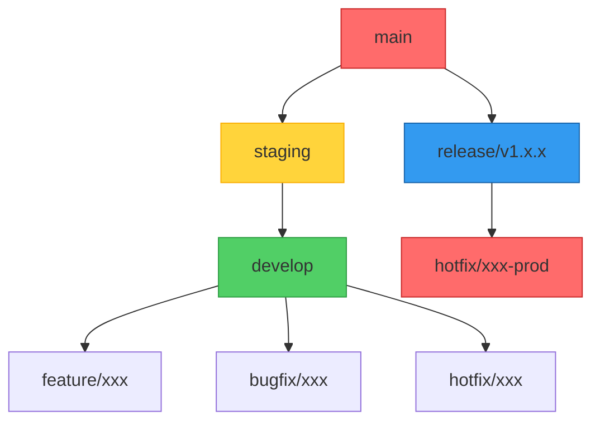
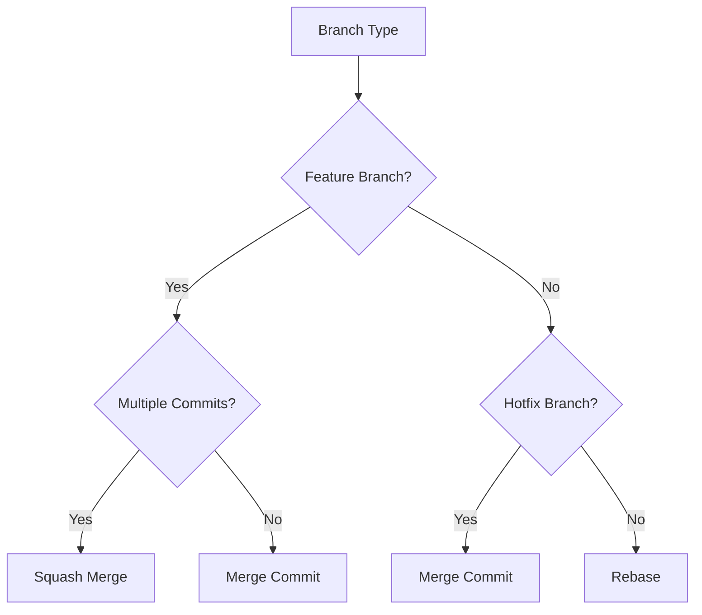
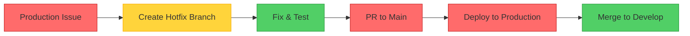

# MoodOverMuscle Git Workflow & Branching Strategy

## Overview

This document outlines the comprehensive Git workflow and branching strategy for the MoodOverMuscle fitness website project. The workflow is optimized for Next.js + Vercel deployment with a 3-phase implementation approach, supporting parallel development, quality gates, and continuous deployment.

## Table of Contents

1. [Architecture Overview](#architecture-overview)
2. [Branching Strategy: Enhanced GitHub Flow](#branching-strategy-enhanced-github-flow)
3. [Branch Naming Conventions](#branch-naming-conventions)
4. [Commit Message Standards](#commit-message-standards)
5. [Pull Request Process](#pull-request-process)
6. [Environment Branches Structure](#environment-branches-structure)
7. [Merge Strategies](#merge-strategies)
8. [Release Management](#release-management)
9. [Hotfix Process](#hotfix-process)
10. [CI/CD Pipeline](#cicd-pipeline)
11. [Team Collaboration Guidelines](#team-collaboration-guidelines)
12. [Getting Started](#getting-started)
13. [Troubleshooting](#troubleshooting)
14. [Summary](#summary)

---

**Document Information**
- **Last Updated**: 2025-07-27
- **Version**: 1.0
- **Owner**: Development Team
- **Review Schedule**: Quarterly

---

## Architecture Overview



## 1. Branching Strategy: Enhanced GitHub Flow

### Core Branches

| Branch | Purpose | Environment | Auto Deploy | Protection |
|--------|---------|-------------|-------------|------------|
| `main` | Production code | Production | ✅ Vercel Prod | ✅ Required reviews |
| `staging` | Pre-production testing | Staging | ✅ Vercel Staging | ✅ Required reviews |
| `develop` | Integration branch | Preview | ✅ Vercel Preview | ✅ Required reviews |

### Supporting Branches

| Branch Type | Pattern | Base Branch | Purpose |
|-------------|---------|-------------|---------|
| Feature | `feature/[ticket]-[description]` | `develop` | New features |
| Bugfix | `bugfix/[ticket]-[description]` | `develop` | Bug fixes |
| Hotfix | `hotfix/[ticket]-[description]` | `main` | Production fixes |
| Release | `release/v[major].[minor].[patch]` | `main` | Release preparation |

## 2. Branch Naming Conventions

### Feature Branches
```
feature/MOM-123-add-calendar-integration
feature/MOM-124-client-portal-dashboard
feature/MOM-125-blog-section
```

### Bugfix Branches
```
bugfix/MOM-200-fix-mobile-booking-form
bugfix/MOM-201-resolve-calendar-bug
```

### Hotfix Branches
```
hotfix/MOM-300-fix-payment-gateway
hotfix/MOM-301-urgent-security-patch
```

### Release Branches
```
release/v1.0.0
release/v1.1.0
release/v1.2.0
```

## 3. Commit Message Standards

### Conventional Commits Format
```
<type>(<scope>): <subject>

<body>

<footer>
```

### Types
- **feat**: New feature
- **fix**: Bug fix
- **docs**: Documentation changes
- **style**: Code style changes
- **refactor**: Code refactoring
- **test**: Adding tests
- **chore**: Maintenance tasks
- **perf**: Performance improvements
- **ci**: CI/CD changes

### Scopes
- **booking**: Booking system
- **calendar**: Calendar integration
- **ui**: User interface
- **api**: API endpoints
- **auth**: Authentication
- **seo**: SEO optimizations
- **deps**: Dependencies

### Examples
```
feat(booking): add calendar integration with Google Calendar API

- Implement OAuth2 flow for Google Calendar
- Add availability checking logic
- Create booking confirmation emails

Closes MOM-123
```

```
fix(ui): resolve mobile booking form validation issues

- Fix date picker on iOS devices
- Improve form field validation
- Add loading states for better UX

Fixes MOM-200
```

## 4. Pull Request Process

### PR Templates

#### Feature PR Template
```markdown
## 🎯 Ticket Reference
Fixes: MOM-XXX

## 📋 Description
Brief description of the feature

## 🧪 Testing Instructions
1. Navigate to [URL]
2. Test [specific functionality]
3. Verify [expected behavior]

## ✅ Checklist
- [ ] Code follows style guidelines
- [ ] Self-review completed
- [ ] Tests added/updated
- [ ] Documentation updated
- [ ] Mobile responsiveness verified
- [ ] Accessibility checked

## 📸 Screenshots
[Add relevant screenshots]

## 🚨 Breaking Changes
[Note any breaking changes]
```

#### Bugfix PR Template
```markdown
## 🐛 Bug Description
Brief description of the bug

## 🔧 Solution
Explanation of the fix

## 🧪 Testing
- [ ] Bug reproduction steps verified
- [ ] Fix tested on staging
- [ ] Regression testing completed

## 📊 Impact
[Note any potential side effects]
```

### Review Requirements

#### Code Review Checklist
- [ ] **Functionality**: Does it work as expected?
- [ ] **Performance**: No performance regressions
- [ ] **Security**: No security vulnerabilities
- [ ] **Accessibility**: WCAG 2.1 compliance
- [ ] **Mobile**: Responsive on all devices
- [ ] **SEO**: Proper meta tags and structured data
- [ ] **Tests**: Adequate test coverage
- [ ] **Documentation**: Updated README and comments

#### Required Approvals
- **Feature branches**: 2 approvals (1 technical + 1 product)
- **Bugfix branches**: 1 approval (technical)
- **Hotfix branches**: 1 approval (emergency process)
- **Release branches**: 3 approvals (technical + product + QA)

## 5. Environment Branches Structure

### Development Flow

```mermaid
graph LR
    A[Local Development] --> B[Feature Branch]
    B --> C[Pull Request]
    C --> D[Develop Branch]
    D --> E[Staging Branch]
    E --> F[Main Branch]
    F --> G[Production]
    
    style A fill:#74c0fc,stroke:#339af0
    style B fill:#51cf66,stroke:#2f9e44
    style C fill:#ffd43b,stroke:#fab005
    style D fill:#51cf66,stroke:#2f9e44
    style E fill:#ffd43b,stroke:#fab005
    style F fill:#ff6b6b,stroke:#c92a2a
    style G fill:#ff6b6b,stroke:#c92a2a
```



### Branch Protection Rules

#### Main Branch
- Require pull request reviews: 2
- Require status checks: ✅
- Require branches to be up to date: ✅
- Include administrators: ✅
- Restrict pushes: ✅

#### Staging Branch
- Require pull request reviews: 1
- Require status checks: ✅
- Require branches to be up to date: ✅

#### Develop Branch
- Require pull request reviews: 1
- Require status checks: ✅

## 6. Merge Strategies

### When to Use Each Strategy

| Strategy | Use Case | Command | Example |
|----------|----------|---------|---------|
| **Merge Commit** | Preserving history | `git merge --no-ff` | Feature integration |
| **Squash** | Clean history | `git merge --squash` | Small feature branches |
| **Rebase** | Linear history | `git rebase` | Personal branches |

### Merge Strategy Decision Tree



## 7. Release Management

### Semantic Versioning
- **MAJOR**: Breaking changes (v1.0.0 → v2.0.0)
- **MINOR**: New features (v1.0.0 → v1.1.0)
- **PATCH**: Bug fixes (v1.0.0 → v1.0.1)

### Release Process

#### Phase 1: Core Enhancement (v1.0.x)
- Performance optimization
- Mobile responsiveness
- Booking system enhancements

#### Phase 2: Advanced Features (v1.1.x)
- Client portal
- Blog section
- Advanced booking features

#### Phase 3: Scaling (v1.2.x)
- E-commerce integration
- Community features
- Advanced analytics

### Release Checklist
- [ ] All features tested on staging
- [ ] Performance benchmarks met
- [ ] Security scan passed
- [ ] Accessibility audit completed
- [ ] SEO validation passed
- [ ] Backup verification completed
- [ ] Rollback plan documented

## 8. Hotfix Process

### Emergency Fix Workflow



### Hotfix Process Steps
1. **Identify Issue**: Critical production bug
2. **Create Branch**: `hotfix/MOM-XXX-description`
3. **Implement Fix**: Minimal, targeted change
4. **Test Fix**: Verify on staging
5. **Deploy**: Direct to production
6. **Merge Back**: Ensure develop has fix

### Hotfix Criteria
- **Security vulnerabilities**
- **Payment processing issues**
- **Booking system failures**
- **Critical UI bugs affecting conversions**

## 9. CI/CD Pipeline

### GitHub Actions Workflow

```yaml
name: CI/CD Pipeline
on:
  push:
    branches: [main, staging, develop]
  pull_request:
    branches: [main, staging, develop]

jobs:
  test:
    runs-on: ubuntu-latest
    steps:
      - uses: actions/checkout@v4
      - uses: pnpm/action-setup@v2
      - name: Run tests
        run: |
          pnpm install
          pnpm run type-check
          pnpm run lint
          pnpm run build-validate
```

### Deployment Pipeline
1. **Feature Branch**: Vercel Preview Deployment
2. **Develop Branch**: Vercel Preview Deployment
3. **Staging Branch**: Vercel Staging Deployment
4. **Main Branch**: Vercel Production Deployment

## 10. Team Collaboration Guidelines

### Daily Workflow
1. **Morning**: Pull latest from `develop`
2. **Development**: Work on feature branch
3. **Testing**: Test on local environment
4. **PR**: Create pull request with template
5. **Review**: Code review and approval
6. **Deploy**: Merge and deploy to staging

### Communication Channels
- **GitHub Issues**: Bug reports and feature requests
- **Pull Requests**: Code reviews and discussions
- **Slack/Discord**: Daily communication
- **Weekly Sync**: Sprint planning and retrospectives

### Code Review Guidelines
- **Be constructive**: Provide helpful feedback
- **Be specific**: Point to exact lines
- **Be timely**: Review within 24 hours
- **Be respectful**: Focus on code, not person

## 11. Getting Started

### Initial Setup
```bash
# Clone repository
git clone https://github.com/etrusk/moodovermuscle.git
cd moodovermuscle

# Install dependencies
pnpm install

# Create feature branch
git checkout -b feature/MOM-123-description

# Make changes and commit
git add .
git commit -m "feat(scope): description"

# Push and create PR
git push origin feature/MOM-123-description
```

### Branch Setup Commands
```bash
# Set up branch protection (admin only)
git branch -u origin/develop develop
git branch -u origin/staging staging
git branch -u origin/main main
```

## 12. Troubleshooting

### Common Issues
- **Merge conflicts**: Use `git mergetool` or VS Code merge editor
- **Failed builds**: Check Vercel deployment logs
- **Missing dependencies**: Run `pnpm install`
- **Type errors**: Run `pnpm run type-check`

### Emergency Contacts
- **Technical Lead**: [Contact info]
- **DevOps**: [Contact info]
- **Product Owner**: [Contact info]

---

## Summary

This Git workflow is designed to support the MoodOverMuscle project's 3-phase implementation approach while maintaining code quality, enabling parallel development, and ensuring smooth deployments. The workflow scales from solo development to team collaboration and supports continuous deployment requirements.

For questions or clarifications, please refer to the project documentation or contact the technical team.