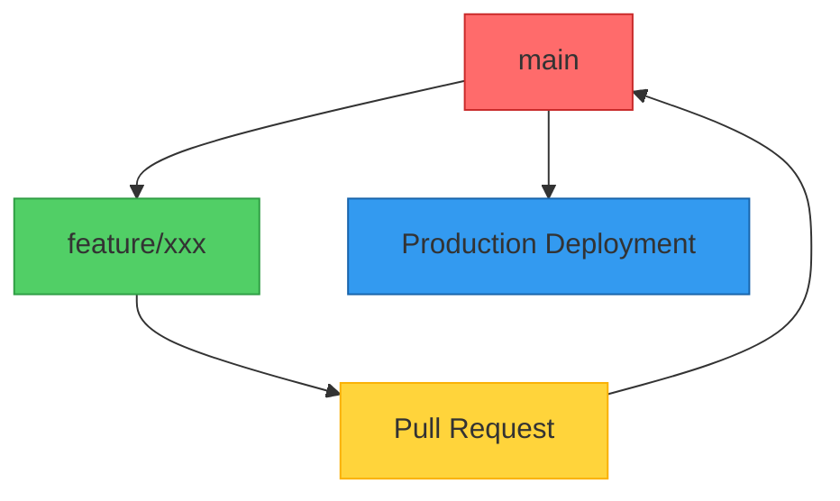
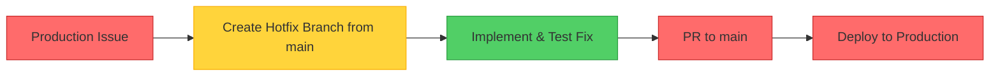

# MoodOverMuscle Git Workflow: Simplified GitHub Flow

## Overview

This document outlines the simplified and effective Git workflow for the MoodOverMuscle fitness website project. The workflow is based on **GitHub Flow**, optimized for Vercel deployments, and designed for continuous delivery, enabling rapid development and deployment while ensuring code quality.

## Table of Contents

1. [Branching Strategy: GitHub Flow](#1-branching-strategy-github-flow)
2. [Branch Naming Conventions](#2-branch-naming-conventions)
3. [Commit Message Standards](#3-commit-message-standards)
4. [Pull Request Process](#4-pull-request-process)
5. [Branch Protection Rules](#5-branch-protection-rules)
6. [Merge Strategy](#6-merge-strategy)
7. [Hotfix Process](#7-hotfix-process)
8. [CI/CD Pipeline](#8-cicd-pipeline)
9. [Team Collaboration Guidelines](#9-team-collaboration-guidelines)
10. [Getting Started](#10-getting-started)

---

**Document Information**
- **Last Updated**: 2025-07-27
- **Version**: 1.0
- **Owner**: Development Team
- **Review Schedule**: Quarterly

---

## 1. Branching Strategy: GitHub Flow

The project follows **GitHub Flow**, a lightweight, branch-based workflow. The `main` branch is always deployable, and all new development is done on feature branches.



### Core Branch

| Branch | Purpose | Environment | Auto Deploy | Protection |
|--------|---------|-------------|-------------|------------|
| `main` | Production-ready code | Production | ✅ Vercel Prod | ✅ Required reviews |

### Supporting Branches

All new work is done on descriptive branches, based off `main`.

| Branch Type | Pattern | Base Branch | Purpose |
|-------------|---------|-------------|---------|
| Feature | `feature/[ticket]-[description]` | `main` | New features |
| Bugfix | `bugfix/[ticket]-[description]` | `main` | Non-urgent bug fixes |
| Hotfix | `hotfix/[ticket]-[description]` | `main` | Urgent production fixes |

## 2. Branch Naming Conventions

### Feature Branches
```
feature/MOM-123-add-calendar-integration
feature/MOM-124-client-portal-dashboard
feature/MOM-125-blog-section
```

### Bugfix Branches
```
bugfix/MOM-200-fix-mobile-booking-form
bugfix/MOM-201-resolve-calendar-bug
```

### Hotfix Branches
```
hotfix/MOM-300-fix-payment-gateway
hotfix/MOM-301-urgent-security-patch
```


## 3. Commit Message Standards

### Conventional Commits Format
```
<type>(<scope>): <subject>

<body>

<footer>
```

### Types
- **feat**: New feature
- **fix**: Bug fix
- **docs**: Documentation changes
- **style**: Code style changes
- **refactor**: Code refactoring
- **test**: Adding tests
- **chore**: Maintenance tasks
- **perf**: Performance improvements
- **ci**: CI/CD changes

### Scopes
- **booking**: Booking system
- **calendar**: Calendar integration
- **ui**: User interface
- **api**: API endpoints
- **auth**: Authentication
- **seo**: SEO optimizations
- **deps**: Dependencies

### Examples
```
feat(booking): add calendar integration with Google Calendar API

- Implement OAuth2 flow for Google Calendar
- Add availability checking logic
- Create booking confirmation emails

Closes MOM-123
```

```
fix(ui): resolve mobile booking form validation issues

- Fix date picker on iOS devices
- Improve form field validation
- Add loading states for better UX

Fixes MOM-200
```

## 4. Pull Request Process

### PR Templates

#### Feature PR Template
```markdown
## 🎯 Ticket Reference
Fixes: MOM-XXX

## 📋 Description
Brief description of the feature

## 🧪 Testing Instructions
1. Navigate to [URL]
2. Test [specific functionality]
3. Verify [expected behavior]

## ✅ Checklist
- [ ] Code follows style guidelines
- [ ] Self-review completed
- [ ] Tests added/updated
- [ ] Documentation updated
- [ ] Mobile responsiveness verified
- [ ] Accessibility checked

## 📸 Screenshots
[Add relevant screenshots]

## 🚨 Breaking Changes
[Note any breaking changes]
```

#### Bugfix PR Template
```markdown
## 🐛 Bug Description
Brief description of the bug

## 🔧 Solution
Explanation of the fix

## 🧪 Testing
- [ ] Bug reproduction steps verified
- [ ] Fix tested on staging
- [ ] Regression testing completed

## 📊 Impact
[Note any potential side effects]
```

### Review Requirements

#### Code Review Checklist
- [ ] **Functionality**: Does it work as expected?
- [ ] **Performance**: No performance regressions
- [ ] **Security**: No security vulnerabilities
- [ ] **Accessibility**: WCAG 2.1 compliance
- [ ] **Mobile**: Responsive on all devices
- [ ] **SEO**: Proper meta tags and structured data
- [ ] **Tests**: Adequate test coverage
- [ ] **Documentation**: Updated README and comments

#### Required Approvals
- **All branches**: 1 approval from a team member.
- **Hotfix branches**: 1 approval, but can be merged by the author in an emergency.

## 5. Branch Protection Rules

#### `main` Branch
- **Required Approvals**: 1
- **Required Status Checks**:
  - `lint-and-typecheck`
  - `test`
  - `build`
  - `size-check`
  - `lighthouse`
- **Restrict force pushes**: Enabled
- **Require branches to be up-to-date**: Enabled

## 6. Merge Strategy

**Squash and Merge** is the recommended merge strategy. This practice keeps the `main` branch history clean and focused, with each commit representing a complete feature or fix.

## 7. Hotfix Process

### Emergency Fix Workflow



### Hotfix Process Steps
1.  **Identify Issue**: A critical bug is reported on production.
2.  **Create Branch**: Create a `hotfix` branch directly from `main`.
3.  **Implement Fix**: Write the code to fix the bug.
4.  **Test**: Thoroughly test the fix in a preview environment.
5.  **Deploy**: Merge the PR into `main`, which automatically deploys to production.

### Hotfix Criteria
- **Security vulnerabilities**
- **Data corruption issues**
- **Critical functionality failures (e.g., payment, booking)**

## 8. CI/CD Pipeline

The CI/CD pipeline is managed by GitHub Actions and Vercel.

### GitHub Actions Workflow (`.github/workflows/ci.yml`)
- **Triggers**: Pushes and pull requests to `main`.
- **Jobs**:
    - `lint-and-typecheck`: Ensures code quality.
    - `test`: Runs unit and integration tests.
    - `build`: Validates that the application builds successfully.
    - `size-check`: Monitors the application's bundle size.
    - `lighthouse`: Audits performance, accessibility, and SEO.

### Vercel Deployments
- **Production**: Every push to `main` is automatically deployed to production.
- **Preview**: Every pull request creates a unique preview deployment.

## 9. Team Collaboration Guidelines

### Daily Workflow
1.  **Sync**: Pull the latest changes from `main`.
2.  **Branch**: Create a new feature or bugfix branch.
3.  **Develop**: Implement and test changes locally.
4.  **Commit**: Use conventional commit messages.
5.  **Push**: Push the branch to GitHub.
6.  **Pull Request**: Open a PR against `main` for review.

## 10. Getting Started

```bash
# 1. Clone the repository
git clone https://github.com/etrusk/moodovermuscle.git
cd moodovermuscle

# 2. Install dependencies
pnpm install

# 3. Create a feature branch from main
git checkout main
git pull
git checkout -b feature/MOM-123-new-feature-name

# 4. Make changes, commit, and push
git add .
git commit -m "feat(new-feature): implement new functionality"
git push origin feature/MOM-123-new-feature-name

# 5. Open a Pull Request in GitHub
```

## Summary

This simplified GitHub Flow is designed for efficiency and speed, ensuring that the `main` branch is always stable and deployable. By leveraging feature branches and Vercel's preview deployments, we can develop, review, and deploy with confidence.